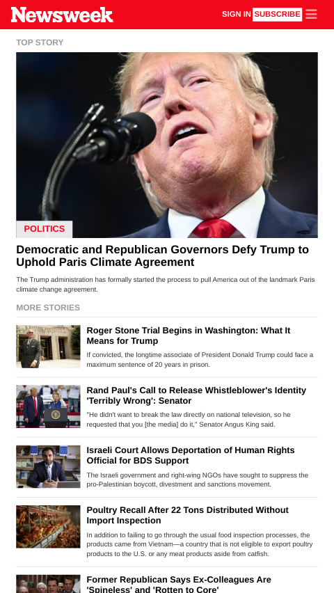

# newsweek

Clone of Newsweek - Responsive Website

## Table of Contents

* [About the Project](#about-the-project)
  * [Built With](#built-with)
* [Get a local copy](#get-a-local-copy)
* [Contributing](#contributing)
* [Contact](#contact)
* [Acknowledgements](#acknowledgements)

<!-- ABOUT THE PROJECT -->
## About The Project

### Desktop version


### Mobile version



URL to the live version of the project: [Newsweek Clone](https://rawcdn.githack.com/ermin-cahtarevic/newsweek/7a3f3e122276a3f0a5008a3b9866d224a2969815/index.html)

This a rebuild of Newsweek responsive website. The rebuid was done using Bootstrap 4. The page used for reference is [Newsweek](https://www.newsweek.com/)

### Built With

* [Bootstrap](https://getbootstrap.com/)
* [HTML](https://github.com/ermin-cahtarevic/newsweek/blob/developer-branch/index.html)
* [CSS](https://github.com/ermin-cahtarevic/newsweek/blob/developer-branch/style.css)

### Get a local copy

**Clone the repository by running this command in your terminal**
```
git clone git@github.com:ermin-cahtarevic/newsweek.git
```

**Navigate into the newly created folder**
```
cd newsweek
```

**Open the index.html file in your browser to see the website** 

**Tests**

Tests have not been added yet, they are something that should be added eventually


## Contributing

Contributions are what make the open source community such an amazing place to learn, inspire, and create. Any contributions you make are **greatly appreciated**.

1. Fork the Project
2. Create your Feature Branch (`git checkout -b feature/AmazingFeature`)
3. Commit your Changes (`git commit -m 'Add some AmazingFeature'`)
4. Push to the Branch (`git push origin feature/AmazingFeature`)
5. Open a Pull Request


<!-- CONTACT -->
## Contact

Ermin Cahtarevic - [Github](https://github.com/ermin-cahtarevic) | erminc@windowslive.com

Project Link: [Newsweek Clone - Repository](https://github.com/ermin-cahtarevic/newsweek/tree/developer-branch)


<!-- ACKNOWLEDGEMENTS -->
## Acknowledgements

* [Microverse](https://www.microverse.org/)
* [Newsweek](https://www.newsweek.com/)
* [Bootstrap](https://getbootstrap.com/)
